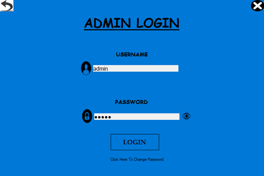

# 🏢 E-Ration Management System

A VB.NET + SQL Server-based system for transparent and efficient ration card management and distribution.

## 📂 Project Structure

- `src/`: Code files (VB.NET)
- `database/schema.sql`: SQL database schema
- `docs/Project_Report.pdf`: Final project report
- `screenshots/`: Screenshots of the application

## 🛠 Technologies

- VB.NET (Visual Studio 2010)
- SQL Server 2008
- Windows Forms

## 💡 Features

- Admin and User login
- Ration allotment (APL/BPL)
- Stock & price list management
- Purchase tracking
- User management panel

## 📸 Screenshots

| Login Page | Home Page | Price List |
|------------|-----------|------------|
|  |  |  |

## 💾 How to Run

1. Open project in Visual Studio 2010
2. Attach the database via SQL Server
3. Run the application using `F5`

## 📄 Documentation

- [📘 Full Project Report (PDF)](docs/Project_Report.pdf)
- [🧾 Database Schema (SQL)](database/schema.sql)

## 👤 Admin Credentials

## 📜 License

Open-source for learning & academic use.
